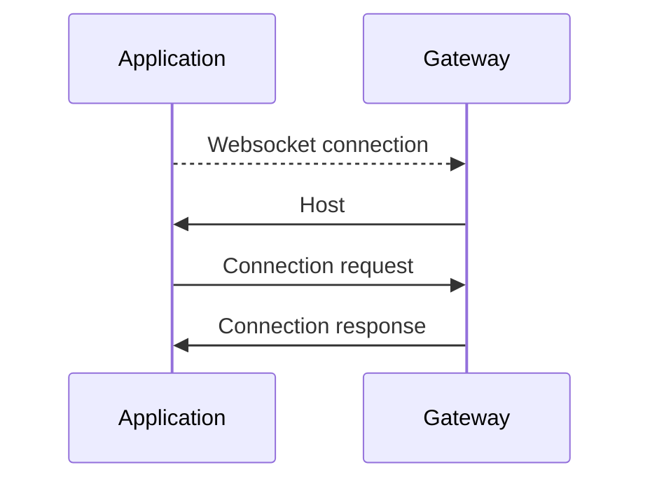
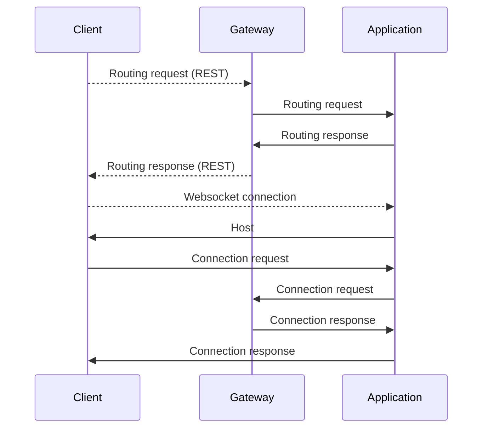
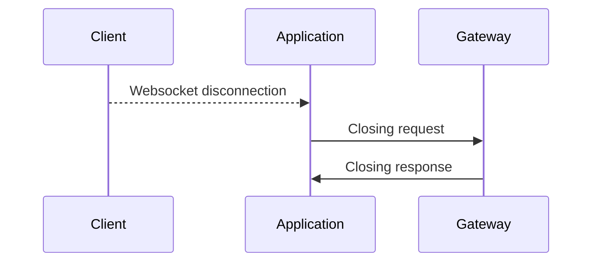
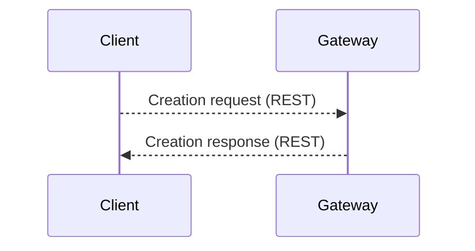
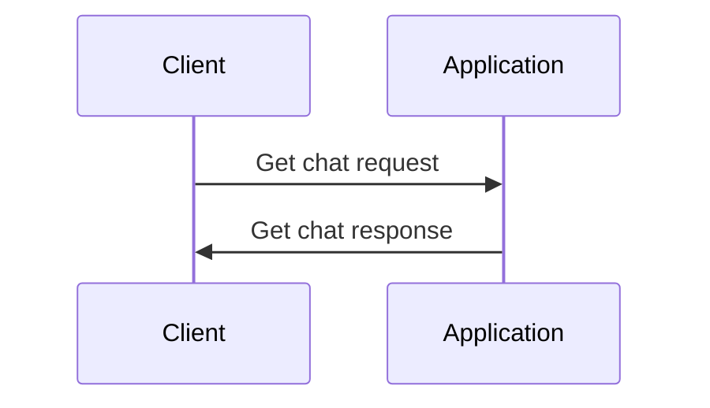
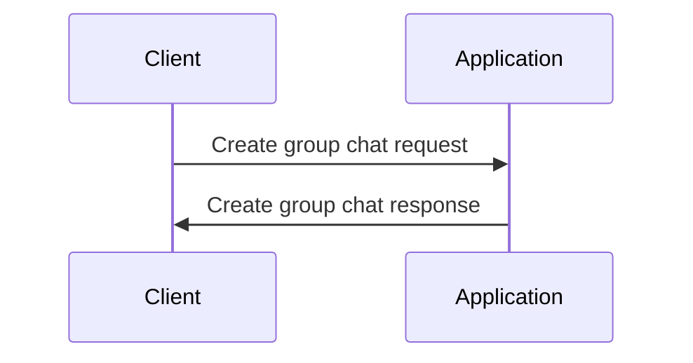
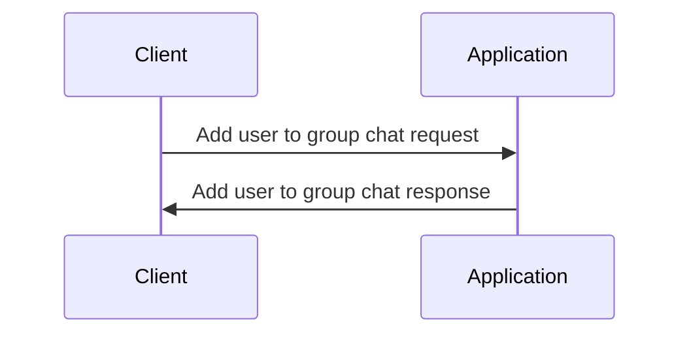
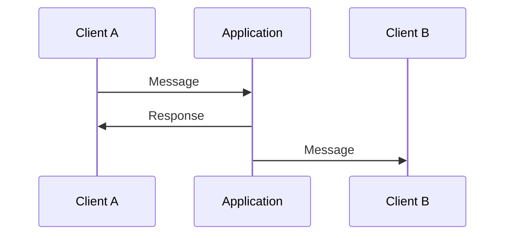
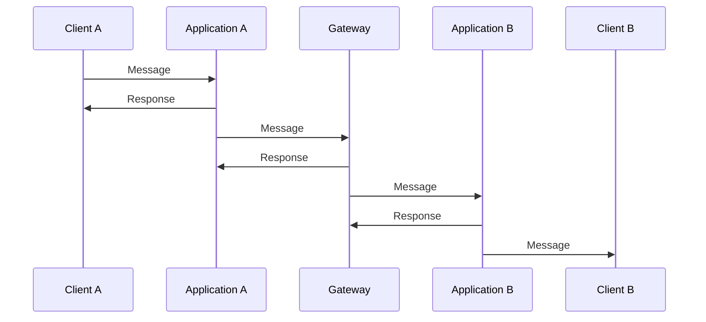

# Protocolo

- [Protocolo](#protocolo)
    - [Formato](#formato)
    - [Fluxo de conexões](#fluxo-de-conexões)
        - [Conexão entre servidor de aplicação e o gateway](#conexão-entre-servidor-de-aplicação-e-o-gateway)
        - [Conexão entre cliente e o gateway](#conexão-entre-cliente-e-o-gateway)
        - [Fechamento de conexão com o cliente](#fechamento-de-conexão-com-o-cliente)
        - [Criação de usuário](#criação-de-usuário)
        - [Obtenção de uma conversa](#obtenção-de-uma-conversa)
        - [Criação de uma conversa em grupo](#criação-de-uma-conversa-em-grupo)
        - [Adição de usuário em uma conversa em grupo](#adição-de-usuário-em-uma-conversa-em-grupo)
        - [Envio de mensagem](#envio-de-mensagem)

## Formato

```json
{
  "id": "[id]",
  "hostType": "[type]",
  "token": "[token]"
  |
  null,
  "status": "[status]"
  |
  null,
  "operationType": "[operationType]",
  "payloadType": "[payloadType]",
  "payload": {
    ...
  }
  |
  null
}
```

- **Host**: Endereço do host que enviou a mensagem.
- **hostType**: Tipo de host que enviou a mensagem.
    - **CLIENT**: Cliente.
    - **GATEWAY**: Servidor de gateway.
    - **APPLICATION**: Servidor de aplicação.
- **Token**: Token de autenticação.
- **Status**: Status da mensagem.
    - **OK**: Mensagem enviada com sucesso.
    - **ERROR**: Erro ao enviar a mensagem.
- **operationType**: Tipo de operação.
    - **REQUEST**: Pedido.
    - **RESPONSE**: Resposta.
    - **INFO**: Informação
- **payloadType**: Tipo de payload.
    - **APPLICATION_CONNECTION**: Conexão da aplicação.
    - **CLIENT_CONNECTION**: Conexão do usuário.
    - **ROUTING**: Roteamento.
    - **USER_CREATION**: Criação do usuário.
    - **USER_LISTING**: Listagem de usuários.
    - **DISCONNECTION**: Fechamento de conexão.
    - **GROUP_CHAT_CREATION**: Criação de conversa em grupo.
    - **CHAT_LISTING**: Listagem de conversas.
    - **GROUP_CHAT_ADDITION**: Adição de usuário na conversa.
    - **MESSAGE**: Mensagem.
    - **MESSAGE_FORWARDING**: Mensagem redirecionada.
    - **MESSAGE_LISTING**: Listagem de mensagens.
    - **HOST**: Host.
- **payload**: Dados da mensagem, pode ser nulo.

---

## Fluxo de conexões

### Conexão entre servidor de aplicação e o gateway



1. A conexão é estabelecida.

2. O Gateway informa o host do servidor de aplicação.

```json
{
  "id": "[id]",
  "hostType": "GATEWAY",
  "token": null,
  "status": "[status]",
  "operationType": "INFO",
  "payloadType": "HOST",
  "payload": {
    "host": "[host]"
  }
}
```

3. O servidor de aplicação envia uma mensagem de conexão para o gateway.

```json
{
  "id": "[id]",
  "hostType": "APPLICATION",
  "token": null,
  "status": null,
  "operationType": "REQUEST",
  "payloadType": "APPLICATION_CONNECTION",
  "payload": {
    "identifier": "[id]",
    "password": "[password]",
    "host": "[host]",
    "externalPort": "[externalPort]"
  }
}
```

4. O gateway responde com uma mensagem de status.

```json
{
  "id": "[id]",
  "hostType": "GATEWAY",
  "token": null,
  "status": "[status]",
  "operationType": "RESPONSE",
  "payloadType": "APPLICATION_CONNECTION",
  "payload": {
    "token": "[token]"
  }
}
```

---

### Conexão entre cliente e o gateway



1. O cliente se conecta e faz a requisição de login com REST.

2. O gateway autentica e avisa um servidor de aplicação.

```json
{
  "id": "[id]",
  "hostType": "GATEWAY",
  "token": null,
  "status": null,
  "operationType": "REQUEST",
  "payloadType": "ROUTING",
  "payload": {
    "userId": "[id]",
    "token": "[token]"
  }
}
```

3. O servidor de aplicação confirma que recebeu a mensagem.

```json
{
  "id": "[id]",
  "hostType": "APPLICATION",
  "token": "[token]",
  "status": "[status]",
  "operationType": "RESPONSE",
  "payloadType": "ROUTING",
  "payload": {
    "userId": "[id]",
    "token": "[token]"
  }
}
```

4. O gateway avisa o cliente do roteamento pela conexão REST.

5. O cliente se conecta com o servidor de aplicação.

6. O servidor de aplicação envia para o cliente as informações de host (o id e o host retornados deverão ser usados pelo cliente nos próximos pacotes).

```json
{
  "id": "[id]",
  "hostType": "APPLICATION",
  "token": "[token]",
  "status": "[status]",
  "operationType": "INFO",
  "payloadType": "HOST",
  "payload": {
    "host": "[host]"
  }
}
```

7. O cliente envia as informações de conexão para o servidor direcionado.

```json
{
  "id": "[id]",
  "hostType": "CLIENT",
  "token": "[token]",
  "status": null,
  "operationType": "REQUEST",
  "payloadType": "CLIENT_CONNECTION",
  "payload": {
    "host": "[host]",
    "userId": "[id]"
  }
}
```

8. O servidor avisa o gateway da conexão do cliente.

```json
{
  "id": "[id]",
  "hostType": "APPLICATION",
  "token": "[token]",
  "status": null,
  "operationType": "REQUEST",
  "payloadType": "CLIENT_CONNECTION",
  "payload": {
    "userId": "[userId]",
    "clientId": "[clientId]"
  }
}
```

9. O gateway avisa o servidor de aṕlicação que a conexão está ok.

```json
{
  "id": "[id]",
  "hostType": "APPLICATION",
  "token": null,
  "status": "[status]",
  "operationType": "RESPONSE",
  "payloadType": "CLIENT_CONNECTION",
  "payload": {
    "userId": "[userId]",
    "clientId": "[clientId]"
  }
}
```

10. O servidor de aplicação avisa o cliente que a conexão foi feita.

```json
{
  "id": "[id]",
  "hostType": "APPLICATION",
  "token": "[token]",
  "status": null,
  "operationType": "REPONSE",
  "payloadType": "CLIENT_CONNECTION",
  "payload": null
}
```

---

### Fechamento de conexão com o cliente



1. O cliente se desconecta.

2. O servidor envia uma requisição de fechamento para o gateway.

```json
{
  "id": "[id]",
  "hostType": "APPLICATION",
  "token": "[token]",
  "status": null,
  "operationType": "REQUEST",
  "payloadType": "DISCONNECTION",
  "payload": {
    "userId": "[id]"
  }
}
```

3. O gateway responde para o servidor.

```json
{
  "id": "[id]",
  "hostType": "GATEWAY",
  "token": null,
  "status": "[status]",
  "operationType": "RESPONSE",
  "payloadType": "DISCONNECTION",
  "payload": {
    "message": "[message]"
  }
}
```

5. O cliente se desconecta.

---

### Criação de usuário



1. O cliente se conecta e faz a requisição de criação de usuário.

2. O Gateway informa o cliente sobre o status da criação de usuário.

---

### Obtenção de uma conversa



---

### Criação de uma conversa em grupo



---

### Adição de usuário em uma conversa em grupo



---

### Envio de mensagem

Cenário em que os dois usuários estão conectados em um mesmo servidor.



Cenário em que os dois usuários estão conectados em servidores diferentes.


