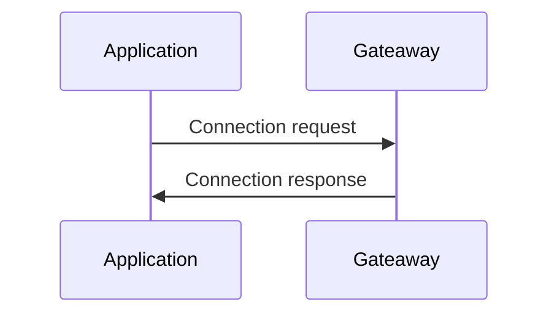
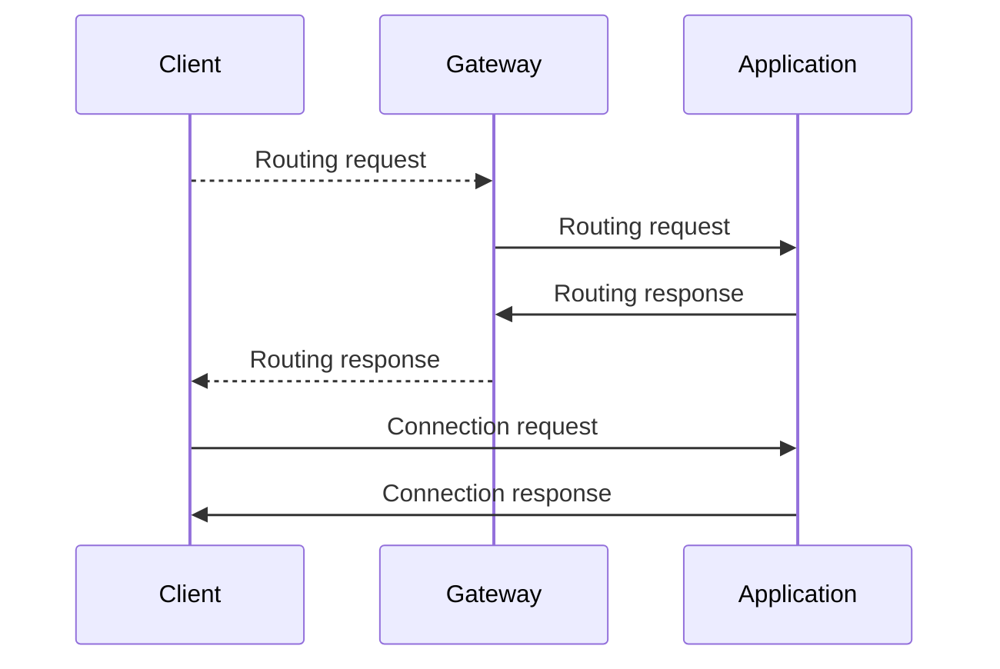
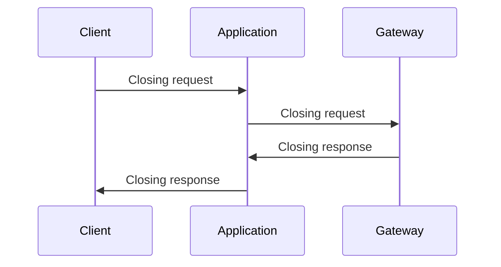
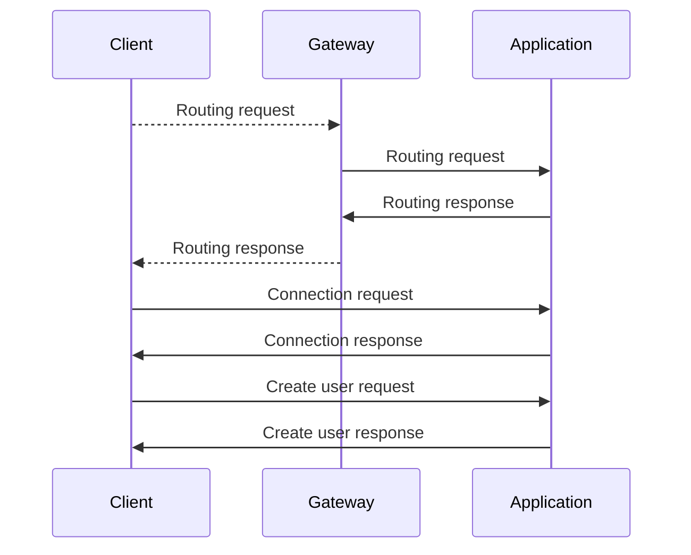
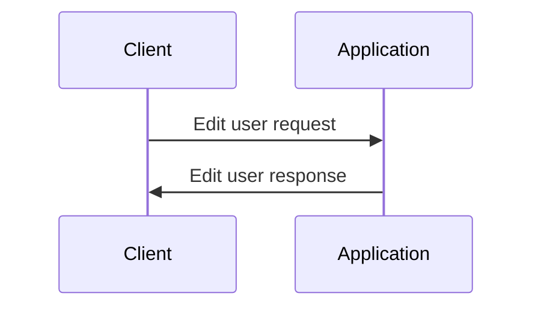
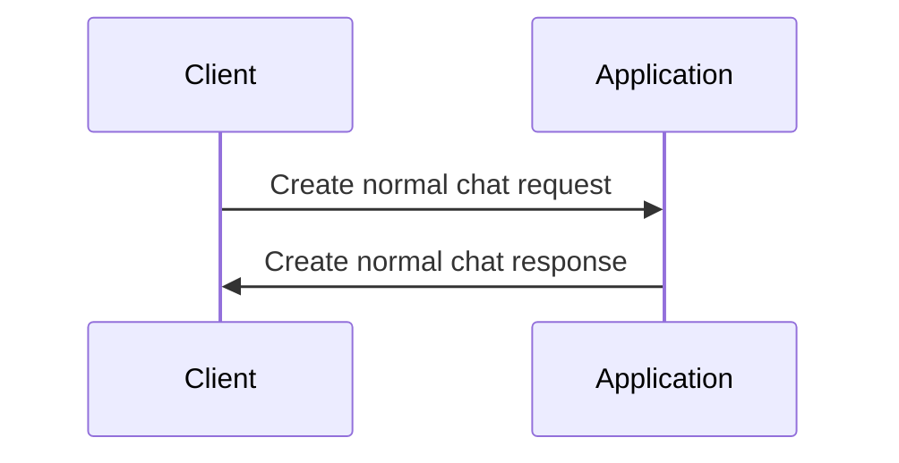
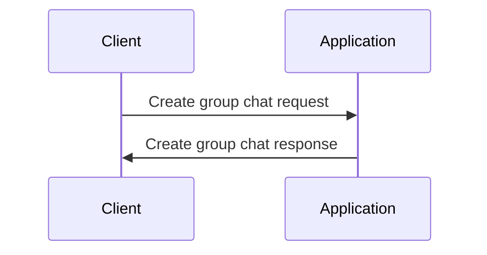
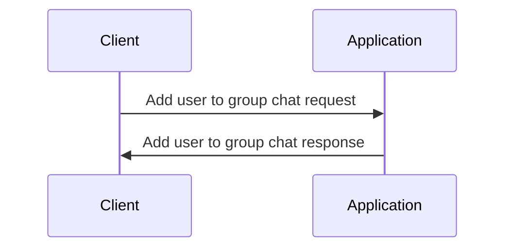

# Protocolo

## Formato

```json
{
    "host": "[ip:port]",
    "hostType": "[type]",
    "token": "[token]" | null,
    "status": "[status]" | null,
    "operationType": "[operationType]",
    "payloadType": "[payloadType]",
    "payload": {...} | null
}
```

* **Host**: Endereço do host que enviou a mensagem.
* **hostType**: Tipo de host que enviou a mensagem.
  * **CLIENT**: Cliente.
  * **GATEWAY**: Gateway.
  * **APPLICATION**: Aplicação.
* **Token**: Token de autenticação.
* **Status**: Status da mensagem.
  * **OK**: Mensagem enviada com sucesso.
  * **ERROR**: Erro ao enviar a mensagem.
* **operationType**: Tipo de operação.
  * **REQUEST**: Pedido.
  * **RESPONSE**: Resposta.
* **payloadType**: Tipo de payload.
  * **CONNECTION**: Conexão.
  * **ROUTING**: Roteamento.
  * **CLOSING**: Fechamento de conexão.
  * **USER**: Usuário.
  * **CHAT**: Conversa.
  * **MESSAGE**: Mensagem.
* **payload**: Dados da mensagem, pode ser nulo.

---

## Fluxo de conexões

### Conexão entre servidor de aplicação e o gateway



1. O cliente envia uma mensagem de conexão para o gateway.

```json
{
    "host": "[ip:port]",
    "hostType": "APPLICATION",
    "token": null,
    "status": null,
    "operationType": "REQUEST",
    "payloadType": "CONNECTION",
    "payload": {
        "identifier": "[id]",
        "password": "[password]"
    }
}
```

2. O gateway responde com uma mensagem de status.

```json
{
    "host": "[ip:port]",
    "hostType": "GATEWAY",
    "token": null,
    "status": "[status]",
    "operationType": "RESPONSE",
    "payloadType": "CONNECTION",
    "payload": null
}
```

---

### Conexão entre cliente e o gateway



1. O cliente envia uma mensagem de conexão para o gateway.

```json
{
    "host": "[ip:port]",
    "hostType": "CLIENT",
    "token": null,
    "status": null,
    "operationType": "REQUEST",
    "payloadType": "ROUTING",
    "payload": {
        "identifier": "[id]",
        "password": "[password]"
    }
}
```

2. O gateway autentica a conexão e envia avisa um servidor de aplicação.

```json
{
    "host": "[ip:port]",
    "hostType": "GATEWAY",
    "token": null,
    "status": null,
    "operationType": "REQUEST",
    "payloadType": "ROUTING",
    "payload": {
        "userId": "[id]",
        "token": "[token]"
    }
}
```

3. O servidor de aplicação confirma que recebeu a mensagem.

```json
{
  "host": "[ip:port]",
  "hostType": "APPLICATION",
  "token": null,
  "status": "[status]",
  "operationType": "RESPONSE",
  "payloadType": "ROUTING",
  "payload": {
    "userId": "[id]",
    "token": "[token]"
  }
}
```

4. O gateway avisa o cliente do roteamento.

```json
{
    "host": "[ip:port]",
    "hostType": "GATEWAY",
    "token": null,
    "status": "[status]",
    "operationType": "RESPONSE",
    "payloadType": "ROUTING",
    "payload": {
        "userId": "[id]",
        "token": "[token]",
        "applicationHost": "[ip:port]"
    }
}
```

5. O cliente tenta a conexão com o servidor direcionado.

```json
{
    "host": "[ip:port]",
    "hostType": "CLIENT",
    "token": "[token]",
    "status": null,
    "operationType": "REQUEST",
    "payloadType": "CONNECTION",
    "payload": null
}
```

6. O servidor responde com o status.

```json
{
    "host": "[ip:port]",
    "hostType": "CLIENT",
    "token": null,
    "status": "[status]",
    "operationType": "REQUEST",
    "payloadType": "CONNECTION",
    "payload": null
}
```

---

### Fechamento de conexão com o cliente



---

### Criação de usuário



---

### Edição de usuário



---

### Criação de uma conversa normal (entre dois usuários)



---

### Criação de uma conversa em grupo



---

### Adição de usuário em uma conversa em grupo



---

### Envio de mensagem

_WIP_
